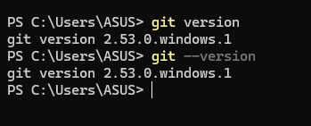
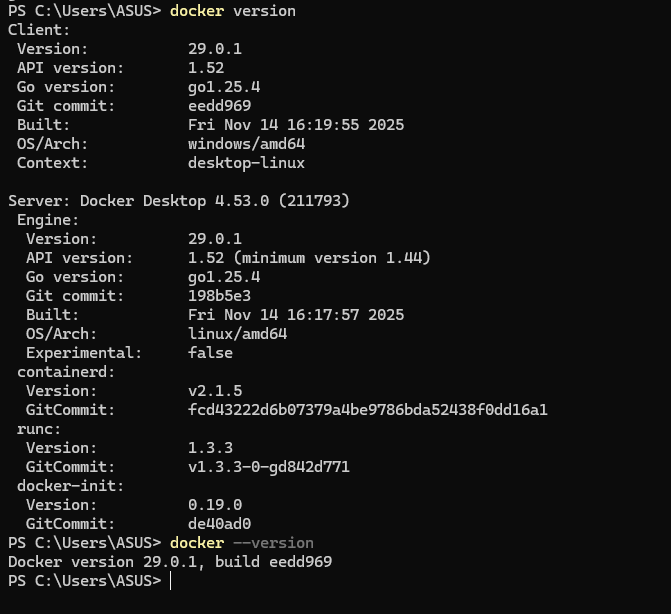
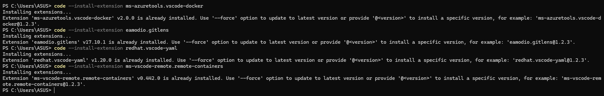

# Laporan Praktikum Pertemuan 01

## 1. Penjelasan tentang DevOps dan Mengapa Penting

**DevOps** adalah serangkaian praktik, budaya, dan alat yang menggabungkan pengembangan perangkat lunak (Dev) dan operasi teknologi informasi (Ops). Tujuannya adalah untuk memperpendek pengembangan siklus hidup sistem dan memberikan pengiriman perangkat lunak secara berkelanjutan dengan kualitas perangkat lunak yang tinggi.

**Mengapa DevOps penting?**

- **Pengiriman lebih cepat:** Mempercepat proses dan frekuensi rilis dari kode ke produksi.
- **Kolaborasi yang lebih baik:** Menyatukan tim pengembang (developer) dan operasi (IT operations) untuk bekerja secara lebih sinkron.
- **Efisiensi dan Otomatisasi:** Mengurangi pekerjaan manual yang berulang melalui CI/CD (Continuous Integration / Continuous Deployment).
- **Kualitas dan Keandalan:** Bug dapat terdeteksi lebih awal sehingga meningkatkan kualitas dan kelancaran rilis aplikasi.

## 2. Penjelasan Tools Pendukung

### Docker

**Docker** adalah platform perangkat lunak yang memungkinkan pengembang untuk membuat, menguji, dan mendeploy aplikasi dengan cepat di dalam lingkungan terisolasi yang disebut _container_. Container ini membungkus kode perangkat lunak beserta seluruh dependensinya (pustaka, alat sistem, dan runtime), sehingga aplikasi dijamin dapat berjalan secara konsisten di lingkungan apa pun, dari laptop penguji hingga ke server produksi.

### GitLens

**GitLens** adalah ekstensi populer (add-on) pada Visual Studio Code yang secara signifikan meningkatkan fitur manajemen kontrol _source code_ (Git) bawaan dari editor tersebut. Fitur utamanya adalah _inline git blame_, yang menampilkan siapa, kapan, dan detail komit apa yang mengubah suatu baris kode. Ekstensi ini sangat mempermudah pelacakan perubahan sejarah kode, review kode, dan kerja sama antar developer dalam satu tim.

### YAML

**YAML** (kependekan rekursif dari _YAML Ain't Markup Language_) adalah standar format serialisasi data (seperti JSON atau XML) yang sangat mudah dibaca oleh manusia. Format pembacaannya berbasis indentasi spasi dan elemen yang lebih sedikit. Di dunia DevOps yang modern, file `.yml` atau `.yaml` secara luas digunakan sebagai format penulisan file konfigurasi standar, seperti pada konfigurasi Docker Compose, Kubernetes, GitLab CI/CD, hingga GitHub Actions pipelines.

## 3. Panduan Instalasi dan Konfigurasi Dasar

### Cara Install Ekstensi VSCode via Terminal

Untuk menginstal ekstensi Visual Studio Code (seperti GitLens atau ekstensi YAML) menggunakan antarmuka baris perintah (Terminal/Command Prompt), Anda dapat menggunakan utilitas CLI bawwaan `code`. Gunakan format perintah berikut: `code --install-extension <publisher.extension-name>`.
Contoh:

- Install ekstensi GitLens: `code --install-extension eamodio.gitlens`
- Install ekstensi YAML dari RedHat: `code --install-extension redhat.vscode-yaml`

### Cara Membuat Akun GitHub

1. Buka browser dan arahkan ke situs resmi GitHub di [https://github.com](https://github.com).
2. Klik tombol **"Sign up"** di pojok kanan atas.
3. Masukkan alamat email aktif Anda dan klik **"Continue"**.
4. Buat kata sandi (password) yang kuat dan tentukan _username_ yang unik.
5. Selesaikan verifikasi interaktif (_captcha_) persetujuan bot jika diminta, lalu klik **"Create account"**.
6. GitHub akan mengirimkan kode verifikasi ke email yang didaftarkan. Masukkan kode tersebut pada halaman GitHub untuk memverifikasi dan mengaktifkan akun.

### Cara Konfigurasi Akun Git

Setelah Anda menginstal Git di komputer lokal, Anda perlu mengatur identitas _user_ agar setiap perubahan (commit) yang Anda buat tercatat dengan nama dan email Anda dengan valid. Buka Terminal, Command Prompt, atau Git Bash dan jalankan perintah berikut secara berurutan:

1. Atur nama pengguna (Ganti `"Nama Anda"` dengan nama panggilan atau nama lengkap Anda):
   ```bash
   git config --global user.name "Nama Anda"
   ```
2. Atur alamat email (Ganti `"email@anda.com"` dengan email yang Anda gunakan saat mendaftar GitHub):
   ```bash
   git config --global user.email "email@anda.com"
   ```
3. _(Opsional)_ Untuk memverifikasi apakah identitas telah terkonfigurasi dengan benar, ketik perintah berikut:
   ```bash
   git config --list
   ```

## 4. Screenshot Environment yang Sudah Di-setup

Berikut adalah bukti dokumentasi screenshot environment dari tools yang telah dikonfigurasi:

### Git Version



### Git Config


### Docker Version



### Docker Hello World


### VSCode Extensions


